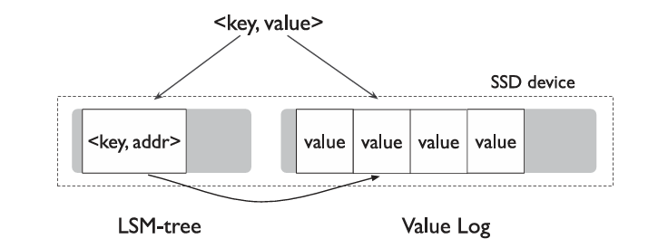
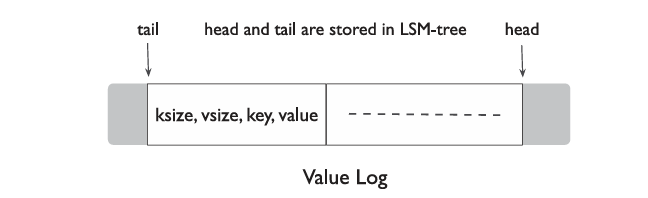

## 1. 项目概述

## 2. 功能设计

#### 2.1. 字段设计

- 设计目标

  - 将 LevelDB 中的 `value` 组织成字段数组，每个数组元素对应一个字段（字段名：字段值）。

  - 不改变LevelDB原有的存储方式，通过对字段数组的序列化和对字符串解析得到字段数组来实现字段功能

  - 在作为key-value对存储进LevelDB之前可以任意调整字段

  - 可以通过字段查询对应的key

- 实现思路

  - 将字段数组设计为一个class `Fields` ，其拥有对于字段进行操作的各种方法，方便对字段的修改，该类也作为 `Get` 方法和 `Put` 方法返回和插入的对象
  - 根据key查询时如果指定字段名则返回对应的字段，如果未指定字段名则返回所有字段
  - Put仅有value时(原本的Put方法)自动给value增加递增的字段
  - (暂定)对于给定的字段，遍历LevelDB得到其对应的所有keys

#### 2.2. KV分离

- 设计目标
  - 拓展key-value存储结构，分离key和value的存储，从而对写放大进行优化
  - 不影响LevelDB原本接口的正常功能
  - 分离存储Value的Value-Log需要有对应的GC(Garbage Collection)功能，在达到一定条件(如Value -Log超过大小阈值)时触发，回收Value-Log中已经失效的Value
  - 确保操作的原子性
- 设计思路
  - 存入LSM-tree中的kv对为 `<key, value-addr>` ，value-addr保存了 `<vLog-offset, value-size>` ，对应value在vLog开始位置的便宜和value的大小
  - vLog的写入可以仿照LevelDB的Memtable机制，以防止频繁的写磁盘
  - vLog采用Append-Only，新数据仅在head添加，在回收时从tail处取得一块chunk，将其中有效的数据Append到head处，同时保证tail被永久保存到LSM-tree中，最后将整块chunk释放
  - 为了优化GC的效率，vLog同时存储key和value，而不是仅存入value
  - **`(可能的优化)`** 因为vLog同时存入了key和value，因此LSM-tree不再需要log file，因为在恢复时可以通过vLog进行恢复，但对整个vLog扫描是不可取的，因此可以定期在LSM-tree中更新head(vLog的末尾)，在恢复时从该head恢复到当前vLog的最末端

## 3. 数据结构设计

#### 3.1. 字段功能

- Field, FieldArray

  - ```c++
    using Field = std::pair<std::string, std::string>;
    using FieldArray = std::vector<std::pair<std::string, std::string>>;
    ```

- Fields

  - 封装有 `std::map<std::string, std::string>` 的class，其接口在 **[4](#4. 接口/函数设计)**中详细描述，用map实现在字段较多时可以获得较高的查询效率

#### 3.2. KV分离

- Key-Value分离结构图示：



- Value Log中实际存储的内容 ：



## 4. 接口/函数设计

#### 4.1. 字段功能

- Fields

  - ```c++
    class Fields {
        private:
        	std::map<std::string, std::string> _fields;
        public:
        	// 从FieldArray构建Fields
        	Fields(FieldArray field_array);
        
        	// 从LevelDB存储的Value中解码出Fields
        	Fields(std::string fields_str);
        	~Fields();
        	
        	// 重载[]运算符简便对字段的修改和访问操作
        	std::string& Fields::operator[](const std::string& field_name);
                
            // 获取当前Fields对应的FieldArray
            FieldArray GetFieldArray();
        
        	// 将Fields编码为存入LevelDB的Value
        	std::string Serialize();
    }
    ```

#### 4.2. KV分离

- ```c++
  // 将value写入vLog，并把将要写入LSM-tree的地址返回为value_addr
  // 该函数在Put中被调用
  void WriteValue(const Slice& key, const Slice& value, Slice& value_addr,
                 bool sync);
  ```

- ```c++
  // 通过value_addr从vLog中获得value并返回
  void GetValue(const Slice& value_addr, Slice& value);
  ```

- ```c++
  // ValueLog在LevelDB启动时即作为LevelDB的一个成员初始化一个实例
  // 后续db都使用该实例进行ValueLog相关操作
  class ValueLog {
      private:
      	WriteBuff _buff;
  		uint64_t _head;
      	uint64_t _tail;
      
      	// 将缓存内容真正写入磁盘的vLog中
      	bool WirteDisk();
      public:
      	ValueLog();
      	~ValueLog();
      
      	// 返回vLog中head处的offset
      	uint64_t Head();
      
      	// 返回vLog中tail处的offset
      	uint64_t Tail();
      
      	// 将key-value对插入Value Log，返回对应的value_addr
      	// 若用户要求同步写入，即sync为true，则立即将数据写入磁盘
      	Slice Append(const Slice& key, const Slice& value, bool sync);
      	
      	// 通过value_addr获得value，首先在buff中寻找，然后才真正访问vLog
      	Slice Get(const Slice& value_addr);
      
      	// 对ValueLog文件进行GC操作，释放空间
      	void GarbageCollection(uint64_t chunk_size);
  }
  ```

- ```c++
  // WriteBuff的功能与Memtable极其相似，实现可以大量仿照Memtable，甚至直接使用Memtable
  // 因此，此处仅列出WriteBuff需要提供的两个接口，其他成员不再列出
  class WriteBuff {
      // 向buff中插入一条value_addr-vLogValue(<ksize, vsize, key, value>)对
      void Add(const Slice& value_addr, const Slice& key, const Slice& value);
      
      // 在buff中查询对应value_addr对应的value
      // 找到返回true，否则返回false
      bool Get(const Slice& value_addr);
      
      // 将缓存内容写入磁盘
      bool WirteDisk();
  }
  ```

## 5. 功能测试

## 6. 可能遇到的挑战与解决方案

## 7. 分工和进度安排


