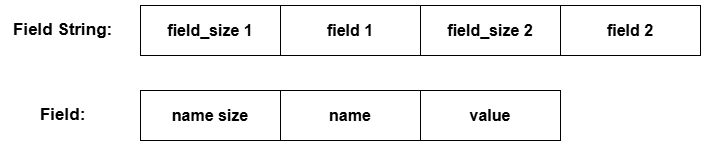
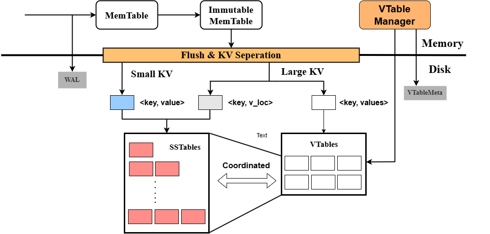
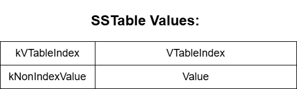
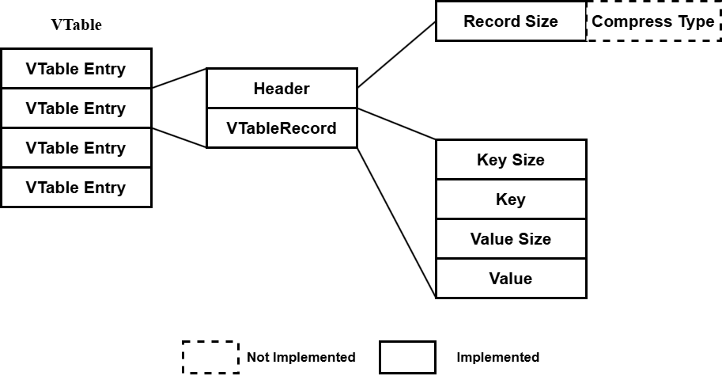
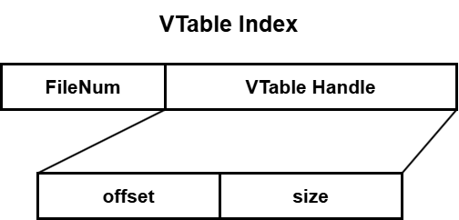
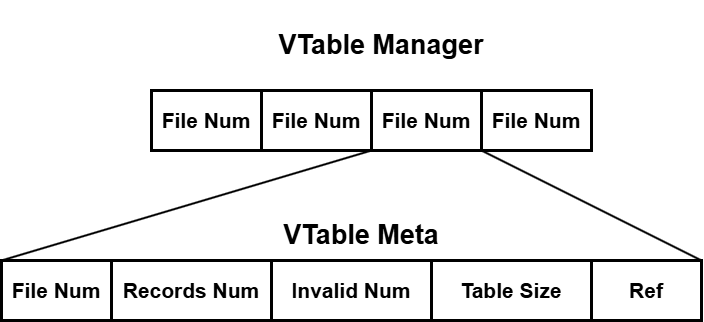
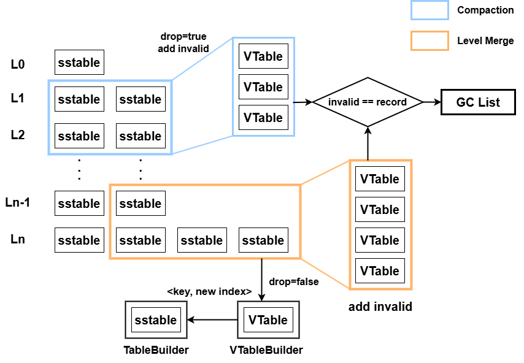

## 1. 项目概述

### 项目背景

本项目基于LevelDB源代码进行修改和优化。`LevelDB`使用`LSM Tree`的数据结构，是`key-value`数据库的典型。LSM树后台为了加速查询，将键值对从磁盘里读取、排序再写入，会带来50倍以上的写放大。这种对HDD有利的优化方式不适用于当下使用较多的SSD，因此我们需要对其功能进行修改和优化。

### 实现功能

本项目要实现的内容及目的是：

+ **字段设计**：模仿关系型数据库，扩展`value`的结构，在`value`中多个字段，并可以通过这些字段进行查询对应的`key`，实现类似关系数据库中按列查询的功能

+ **KV分离**：分离存储LevelDB的`key`和`value`，LSM树中的value为一个指向`Value Log`文件的指针，用户的真实`value`存储在`Value Log`中，减轻LSM树的存储负载，大幅度减小了读写放大的性能影响

## 2. 功能设计

#### 2.1. 字段设计

- 设计目标

    - 将 LevelDB 中的 `value` 组织成字段数组，每个数组元素对应一个字段（字段名：字段值）。

    - 不改变LevelDB原有的存储方式，通过对字段数组的序列化和对字符串解析得到字段数组来实现字段功能

    - 在作为key-value对存储进LevelDB之前可以任意调整字段

    - 可以通过字段查询对应的key

#### 2.2. KV分离

- 设计目标
    - 拓展key-value存储结构，分离key和value的存储，从而对写放大进行优化
    - 不影响LevelDB原本接口的正常功能
    - 分离存储Value的Value-Log需要有对应的GC(Garbage Collection)功能，在达到一定条件(如Value -Log超过大小阈值)时触发，回收Value-Log中已经失效的Value
    - 确保操作的原子性

## 3. Methodology

#### 3.1. 字段功能

对应文件：`db/fields.*`

- Field, FieldArray

  - ```c++
    using Field = std::pair<std::string, std::string>;
    using FieldArray = std::vector<std::pair<std::string, std::string>>;
    ```

- Fields

  - 封装有 `std::map<std::string, std::string>` 的class，代替原本的 `value` 成为`leveldb` 新的存储单位，用map实现在字段较多时可以获得较高的查询效率，提供以下接口：
  
  - ``````c++
    class Fields {
      public:
        // 从FieldArray构建Fields
        explicit Fields(const FieldArray& field_array);
    
        // 从LevelDB存储的Value中解码出Fields
        explicit Fields(const Slice& fields_str);
    
        Fields() = default;
        ~Fields();
    
        // 重载[]运算符简便对字段的修改和访问操作
        std::string& operator[](const std::string& field_name);
    
        // 获取当前Fields对应的FieldArray
        FieldArray GetFieldArray() const;
    
        // 将Fields编码为存入LevelDB的Value
        std::string Serialize() const;
    
        uint64_t size() const { return size_; }
    
      private:
        std::map<std::string, std::string> _fields;
        uint64_t size_ = 0;
    };
    ``````
  
- FieldString

  - `Field String` 是类 `Fields` 等价的编码字符串，`Fields` 可以编码为 `Field String` ，`Field String` 可以解码为 `Fields` 
  
  - 编码后的结构为：
  
    

编码和解码的代码基本调用原本的函数 `PutVarint64` 和 `GetVarint64` 等，非常简单，不在此贴出，可以前往 `db/fields.*` 文件中查看具体实现

#### 3.2 KV分离

- **KV分离的基本框架：**



KV分离发生在 `leveldb` 的小合并的过程中，用户可以自定义一个 `kv_sep_threshold` ，默认为 `1000` ，单位是Byte。当数据从内存中落盘时，根据 `value` 的大小是否超过阈值判断是否要进行KV分离，由于小的Value并不会造成明显的写放大，如果进行分离会严重影响其读性能，弊大于利，因此仅对大的Value进行KV分离是一种能提高小Value读取速度的优化。

此时，存入SSTable的 `value` 存在两种情况：

- 真实的value值（value较小）
- value在VTables中的位置（value较大）

我们通过在Value前增加type标识来区分这两种情况：

```c++
enum Type : unsigned char {
	kVTableIndex = 1,
	kNonIndexValue = 2,
};
```

`kVTableIndex` 表示该value是一个指向value的地址，`kNonIndexValue` 表示该value为value的真实值。两种情况的value如图所示：



- **VTable Format**

接下来对VTable文件结构以及编码和解码进行介绍，代码实现位于文件 `table/vtable_format.*`

VTable的整体结构图：



`VTable` 最基本的存储单位为 `VTableRecord` ，其内容包含存储的 `key`   `value` 对，提供 `Encode` 和 `Decode` 方法进行编码解码，基本使用 `utils/coding.*`的方法，本报告中忽略基本的编码解码代码：

```c++
// VTable最基本的存储单位，表示存储的一个key和一个value
struct VTableRecord {
  Slice key;
  Slice value;

  // 将record编码为str
  void Encode(std::string* target) const;
  // 将Slice解码为record
  Status Decode(Slice* input);

  // 该record的size
  size_t size() const { return key.size() + value.size(); }
};
```

要将 `VTableRecord` 写入 `VTable` ，需要将 `VTableRecord` 结构体编码为一个 `Header` 和相应的 `Record` (<key_size, key, value_size, value>)

为了方便的编码 `VTableRecord` 以构建VTable，实现了 `RecordEncoder` 类对编码过程进行了封装，简化了编码过程：

```c++
class RecordEncoder {
  public:
    // TODO: Support compression while encoding a record
    RecordEncoder() = default;

    // 编码一条vTable record
    void Encode(const VTableRecord& record);

    // 获得编码后的records的size
    size_t GetEncodedSize() const { return sizeof(header_) + record_.size(); }

    // 获取编码后的header
    Slice GetHeader() const { return {header_, sizeof(header_)}; }

    // 获得编码后的record
    Slice GetRecord() const { return record_; }
  private:
    char header_[kRecordHeaderSize];
    Slice record_;

    std::string record_buff_;
};
```

`RecordEncoder::Encode` 方法将对 `record` 进行编码并生成对应的 `header`，Encode完成后就可以调用该类的另外几个方法获得编码后的数据 ：

```c++
void RecordEncoder::Encode(const VTableRecord& record) {
  record_buff_.clear();

  record.Encode(&record_buff_);
  record_ = Slice(record_buff_.data(), record_buff_.size());

  EncodeFixed32(header_, static_cast<uint32_t>(record_.size()));
}
```

从 `VTable` 中获得 `Slice` 后要将其解码为 `VTableRecord`，为此实现了 `RecordDecoder` 类，对解码过程同样进行了封装：

```c++
class RecordDecoder {
  public:
    // 解码出record的header
    Status DecodeHeader(Slice* input);

    // 解码出record
    Status DecodeRecord(Slice* input, VTableRecord* record) const;

    // 获得解码后的record size
    size_t GetDecodedSize() const { return record_size_; }
  private:
    uint32_t record_size_{0};
};
```

使用时先使用 `DecodeHeader` 解码`header` 获得 `record` 的相关信息，再调用 `DecodeRecord` 解码 `record` 的内容

至此，我们已经可以方便的将KV对编码为可以写入VTable的内容，也可以方便的从编码好的 `Slice` 中解码出相应的KV对，我们接下来需要定义 `SSTable` 中存储的 `VTableIndex`，以建立 `SSTable` 中 `index` 和 `VTable` 中 `VTableRecord` 的映射关系

`VTable Index` 的结构如图所示：



其在代码结构中的定义：

```c++
struct VTableHandle {
  // 表示某个record在VTable中的位置
  uint64_t offset{0};
  uint64_t size{0};

  void Encode(std::string* target) const;
  Status Decode(Slice* input);
};

struct VTableIndex {
  // 存入sstable中的index
  enum Type : unsigned char {
    kVTableIndex = 1,
  };

  uint64_t file_number{0};
  VTableHandle vtable_handle;

  void Encode(std::string* target) const;
  Status Decode(Slice* input);
};
```

通过结构体自带的 `Encode` 和 `Decode` 方法可以将 `VTableIndex` 轻松的编码为写入 `SSTable` 的 `Index` ，也可以轻松的将  `SSTable` 中的 `Index` 解码为 `VTableIndex` 结构体

- **VTable Manager**

为了进行 `GC(Garbage Collection)`，我们会在内存中保存每个 `VTable` 的元数据(meta)，`GC` 的具体方法将在后文介绍，本处引出 `VTable Manager` 的部分功能以帮助说明接下来的功能，代码位于 `table/vtable_manager.*` 

`VTableManager` 会作为 `DBImpl` 的成员和数据库共享生命周期

`VTableManager` 和 `VTableMeta`  结构如下：



`VTable Manager` 中用 `VTable Number` 映射到该 `VTable` 对应的元数据，每个 `VTable` 的元数据包括：

- File Num: VTable的序号 `VTable Number` 
- Records Num: 该VTable中的Record的总数量
- Invalid Num：该VTable中无效的Record的总数量
- Table Size：该VTable的文件大小
- Ref：该VTable目前被几个 `Reader` 读取

`VTable Meta` 和 `Vtable Manager` 的代码结构如下：

```c++
struct VTableMeta {
  uint64_t number;
  uint64_t records_num;
  uint64_t invalid_num;
  uint64_t table_size;
  uint64_t ref = 0;

  void Encode(std::string* target) const;
  Status Decode(Slice* input);

  VTableMeta() : number(0), records_num(0), invalid_num(0), table_size(0) {}
};

class VTableManager {
  public:
    explicit VTableManager(const std::string& dbname, Env* env, 
                           size_t gc_threshold) :
      dbname_(dbname),
      env_(env),
      gc_threshold_(gc_threshold) {}

    ~VTableManager() = default;

    // sign a vtable to meta
    void AddVTable(const VTableMeta& vtable_meta);

    // remove a vtable from meta
    void RemoveVTable(uint64_t file_num);

    // add an invalid num to a vtable
    Status AddInvalid(uint64_t file_num);

    // save meta info to disk
    Status SaveVTableMeta() const;

    // recover meta info from disk
    Status LoadVTableMeta();

    // reference a vtable
    void RefVTable(uint64_t file_num);

    // unref a vtable
    void UnrefVTable(uint64_t file_num);

    // maybe schedule backgroud gc
    void MaybeScheduleGarbageCollect();

    // do backgroud gc work
    static void BackgroudGC(void* gc_info);

  private:
    std::string dbname_;
    Env* env_;
    std::map<uint64_t, VTableMeta> vtables_;
    std::vector<uint64_t> invalid_;
    size_t gc_threshold_;
};
```

非GC相关的方法多为增加减少计数和 `VTable Meta` ，因此报告中不展示其具体实现，可在对应文件中找到相关代码

由于 `VTable Manager` 是在 `leveldb` 运行过程中在内存中维护的数据结构，因此一旦程序停止运行，即数据库关闭， `VTable Manager` 存储的元数据就会丢失，而作为一个数据库，其可以在关闭后重启，重启时可以通过遍历所有 `VTable` 并且用其中的key恢复上次关闭时的元数据信息，但是这样恢复的效率在数据量较大时会产生大量的读磁盘，导致启动速度极慢。为了解决这个问题，这里采用了类似 `Log` 的机制，`VTable Manager` 提供了 `SaveVTableMeta` 方法用于将当前元数据状态写入磁盘， `LoadVTableMeta` 方法用于从磁盘中读取并恢复元数据状态

在时机上，遵从 `leveldb` 的机制，即在 `version set`  `LogAndApply` 时调用 `SaveVTableMeta` 保存当前数据库 `VTable Meta` 状态，在数据库启动时的恢复过程中调用 `LoadVTableMeta` 读取关机时数据库中的 `VTable Meta` 状态

- **VTable Builder** 

在上文中我们完成了对 `VTable` 结构的定义，现在需要考虑的问题是如何构建一个 `VTable` 

`SSTable` 提供了 `TableBuilder` 类的封装来方便的构建 `SSTable`，我们同样提供了 `VTableBuilder` 类对 `VTable` 构建进行了封装，从而可以在KV分离功能注入时方便的构建 `VTable` ，代码位于文件 `table/vtable_builder.*` 中

`VTableBuilder` 的代码结构如下：

```c++
class VTableBuilder {
  public:
    VTableBuilder(const Options& options, WritableFile* file);

    // Add a record to the vTable
    void Add(const VTableRecord& record, VTableHandle* handle);

    // Builder status, return non-ok iff some error occurs
    Status status() const { return status_; }

    // Finish building the vTable
    Status Finish();

    // Abandon building the vTable
    void Abandon();

    uint64_t FileSize() const { return file_size_; }

    uint64_t RecordNumber() const { return record_number_; }
  private:
    bool ok() const { return status().ok(); }

    WritableFile* file_;
    uint64_t file_size_{0};
    uint64_t record_number_{0};

    Status status_;

    RecordEncoder encoder_;
};
```

`VTableBuilder` 拥有上文提到的 `RecordEncoder` 用于编码 `Record`，以及要写入的目标 `VTable` 文件

`VTableBuilder` 在建立后必须调用 `Finish` 和 `Abondon` 方法中的一个来结束构建，前者完成文件写入，后者放弃文件的构建

`Add` 方法用于向目标 `Vtable` 中加入一个 `Record` ，并返回该 `Record` 在目标 `VTable` 中的 `VTableHandle` ，即其 `offset` 和 `size`

`Add` 方法通过上文的 `RecordEncoder` ，可以很轻松的实现：

```c++
void VTableBuilder::Add(const VTableRecord& record, VTableHandle* handle) {
  if (!ok()) return;

  encoder_.Encode(record);
  handle->offset = file_size_;
  handle->size = encoder_.GetEncodedSize();
  file_size_ += encoder_.GetEncodedSize();

  status_ = file_->Append(encoder_.GetHeader().ToString() +
                          encoder_.GetRecord().ToString());

  record_number_ += 1;
}
```

通过返回的 `VTableHandle` 和 `VTable Number` ，就可以构造 `VTableIndex` 结构体并调用 `Encode` 编码为写入 `SSTable` 的 `Index` 

- **VTable Reader**

现在我们可以方便的构建 `VTable` 了，我们还需要一个轻松读取 `VTable` 的方法，为此，我们提供了 `VTableReader` 类，其封装了对 `VTable` 内容读取的相关功能，代码位于文件 `table/vtable_reader.*` 中

`VTableReader` 的代码结构如下：

```c++
class VTableReader {
  public:
    VTableReader() = default;

    VTableReader(uint64_t fnum, VTableManager *manager) :
      fnum_(fnum),
      manager_(manager) {};

    Status Open(const Options& options, std::string fname);

    Status Get(const VTableHandle& handle,
               VTableRecord* record) const ;

    void Close();
  private:
    Options options_;
    uint64_t fnum_;
    RandomAccessFile* file_{nullptr};
    VTableManager* manager_{nullptr};
};
```

`VTableReader` 使用时首先调用 `Open` 方法打开 `VTable` 文件，这会增加 `manager`中该 `VTable` 的引用计数 **(Ref)** 然后调用 `Get` 方法，使用 `VTableHandle` 查询对应 `Record` ，并返回 `VTableRecord` 结构体，结束读取后要调用 `Close` 方法减少 `manager` 中该 `VTable` 的 `Ref` 计数

`Get` 方法实现也很简单，通过 `handle` 的信息读取对应的编码 `Slice` ，然后使用上文的 `RecordDecoder` 类的 `DecodeHeader` 和 `DecodeRecord` 方法得到解码后的 `Record` 

- **KV分离功能实现** 

首先是KV分离的节点，我们让KV分离发生在 `Immutable Memtable` 小合并写入磁盘的过程中，`leveldb` 在小合并中通过 `BuildTable` 函数构建 `SSTable` ，我们对该函数进行修改以实现KV分离

逻辑很简单，在 `iteratir` 遍历过程中判断 `value size` 是否达到阈值，未达到则直接写入 `SSTable` ，否则将 `value` 通过 `VTableBuilder` 写入 `VTable` 中，并向 `SSTable` 中写入对应的 `VTableIndex` ，核心代码如下：

```c++
if (value.size() < options.kv_sep_size) {
    // No need to separate key and value
    builder->Add(key, value);
  } else {
    // Separate key value
    ParsedInternalKey parsed;
    if (!ParseInternalKey(key, &parsed)) {
      s = Status::Corruption("Fatal. Memtable Key Error");
      builder->Abandon();
      vtb_builder->Abandon();
      return s;
    }
    value.remove_prefix(1);
    VTableRecord record {parsed.user_key, value};
    VTableHandle handle;
    VTableIndex index;
    std::string value_index;
    vtb_builder->Add(record, &handle);

    index.file_number = meta->number;
    index.vtable_handle = handle;
    index.Encode(&value_index);
    builder->Add(key, Slice(value_index));
  }
```

完成了写入时的KV分离，接下来要解决的是如何对KV分离的数据库进行数据的读取

我们采取的方法是修改 `leveldb` 的 `Get` 方法，对于找到的KV对，我们分析其Value，如果是真实Value就直接返回，否则使用 `VTableReader` 通过 `VTableIndex` 获取其真实Value并返回，最后会将其转化为 `Fields` 类

该过程是一个通用的做法，因此我们将其抽取出来封装为 `DBImpl` 类下的一个方法 `DecodeValue` ，对通过Key查询到的Value进行上述一系列分析：

```c++
Status DBImpl::DecodeValue(std::string* value) const {
  std::string tmp = *value;
  auto input = new Slice(tmp);
  unsigned char type;
  if (!GetValueType(*input, &type)) {
    return Status::Corruption("Fatal Value Error");
  }
  if (type == kNonIndexValue) {
    input->remove_prefix(1);
    *value = input->ToString();
    return Status::OK();
  }
  if (type == kVTableIndex) {
    VTableIndex index;
    VTableRecord record;

    Status s = index.Decode(input);
    if (!s.ok()) {
      return s;
    }

    VTableReader reader(index.file_number, this->vtable_manager_);
    std::string vtb_name = VTableFileName(this->dbname_, index.file_number);
    s = reader.Open(this->options_, vtb_name);
    if (!s.ok()) {
      reader.Close();
      return s;
    }

    s = reader.Get(index.vtable_handle, &record);
    if (!s.ok()) {
      reader.Close();
      return s;
    }
    *value = record.value.ToString();
    reader.Close();
    return s;
  }
  return Status::Corruption("Unsupported value type");
}
```

完成了 `Get` 和 `Put` 方法，我们还需要确保 `iterator` 能够正常使用，以提供范围查询功能

由于当前 `leveldb` 已经实现了 `Fileds` 功能，原本的 `Iterator::value` 方法已经被弃用，取而代之的是 `Iterator::fields` 方法，该方法同样经过上述 `DeocodeValue` 流程，最后返回 `Fields` 类，`DBIter` 中的具体实现：

```c++
  Fields fields() const override {
    assert(valid_);
    if (direction_ == kForward) {
      std::string field_str = iter_->value().ToString();
      db_->DecodeValue(&field_str);
      return Fields(Slice(field_str));
    } else {
      std::string field_str = saved_value_;
      db_->DecodeValue(&field_str);
      return Fields(Slice(field_str));
    }
  }
```

根据原本 `leveldb` 的 `Delete` 逻辑，其插入了一条特殊的Key表示删除，因此无需修改仍可正常使用

为了完成上述对主要方法的支持，还向 `leveldb` 中原本的文件名相关代码中注入了 `VTable` 相关的内容

在 `filename.h` 中增加了 `FileType` ，包括 `kVTableFile` 和 `kVTableManagerFile` ，增加了两个方法 `VTableFileName` 和 `VTableManagerFileName` ，返回对应的文件名

在 `filename.cc` 的 `ParseFileName` 方法中增加了对上述两种文件名的分析

- **Garbage Collection (GC)**

GC是KV分离中的一个非常重要的问题，虽然KV分离的功能显著缓解了原本的写放大问题，但是一旦相同的key有新数据写入，那么原本在 `VTable` 中的旧value已经失效，但是其仍留存在磁盘中，久而久之会造成严重的空间浪费，因此要有GC机制去回收这些额外占用的空间

**传统GC**： 传统GC的方法都相差不大，主要思想都是在合并时统计每个参与合并的 `VTable` 失效的大小，当大小达到一定阈值时对这些文件进行GC，做法是遍历整个 `VTable` ，用其中的key在LSM-Tree中进行查询，如果当前value已过期则跳过，若未过期则写入新的 `VTable` 中，最后回收之前的整个`VTable` ，将新写入 `VTable` 的KV对重新插入LSM-Tree，这种做法会导致额外的写放大，并且要进行多次的查询，GC过程中会严重影响前台的表现

最近，一种新的GC方法被提出，在 `TitanDB` 中作为一项实验功能，名为 `Level Merge` ，其在Compaction过程中，对于要保留的KV对直接写入新的 `VTable` 中，在 `Builder` 构造 `SSTable` 时将其value直接换位新的Index，该过程相当于完成了GC的工作，对于没有有效数据的VTable则可以直接删除，省去了多次查询和插入带来的开销。但由于这种方法本身也会带来写放大，会影响性能，因此只在最后两个 `level` 进行上述 `level merge` ，因为大量的数据都落在最后这两层，无效数据的含量也较高，因此可以在对性能影响较小的情况下优雅的完成GC

关于 `Level Merge` 执行的层数，DiffKV中也选择仅对最后两层执行

综上，我们选择使用新的GC方法，并提供config中配置执行Level Merge的层数

- **GC Overview: ** 

 

在合并中，如果level低于配置层数，对于需要drop的数据，我们在manager中为其对应的 `VTable` 增加一个 `Invalid` 计数，其他的数据按原样合并。如果level高于配置层数，不仅对需要drop的KV对增加 `Invalid` 计数，需要保留的KV对通过 `VTableBuilder` 重新构造新的VTable将其写入，并在新的 `SSTable` 中写入新的Index，为原 `VTable` 增加一个 `Invalid` 计数

每次增加 `Invalid` 计数时，都会判断该 `VTable` 的 `Invalid` 计数是否达到 `Record Num` ，若达到则将其加入 `invalid_` list中，作为GC的候选文件，然后调用 `MaybeScheduleGC` ，判断是否调度GC线程

由于GC过于频繁会影响前台性能，因此我们提供了一个设置，可以调整GC的threshold，即失效文件总大小达到该阈值时，才调度一次GC

如果要调度GC，此时会为GC构建一个 `delete_list` ，判断 `invalid_` 中是否还有文件正在被别的线程读取，仅将 `Ref` 为0的 `VTable` 加入 `delete_list` 中，其它的将继续保留等待下一次调度

最终，manager会将这个删掉的 `VTable元数据` 从内存中抹除，后台GC线程会将这些文件从磁盘中删除

## 4. 实验

#### 4.1 正确性实验：

对KV分离改造后的数据库的正确性进行实验，主要测试 `Fields` 功能和 `leveldb` 的基本功能，即写入，点查询和范围查询等

正确性实验代码位于 `test/*` 目录下，`test_fileds.cc` 验证了 `Fields` 功能的正确性，`test_basicio.cc` 验证了 `leveldb` 的基本功能的正确性，连续多次执行该测试，也能够完成数据库的重启，并且在无效数据大小超过预设 GC 大小后完成了 GC ，通过监控数据库文件夹大小即可发现GC能让数据库大小稳定在一定范围以下 (该测试key范围固定，因此多次插入无效数据必然增多)

#### 4.2 **BenchMark:** 

## 5. 可能的优化空间

- 经过KV分离的数据库，虽然写性能有明显的上升，但在读性能上有明显的下降，为了优化读性能，可以为 `VTable` 设置Cache机制，从而提高顺序读和随机读的性能，但本身 `VTable` 的value较大，Cache可能会需要较多的内存，会增加内存的开销，属于一种空间换时间的优化
- 将 `VTable` 也以类似树的结构按层组织，并在compaction过程中也对 `VTable` 进行Merge，过程中利用 `VTable` 中的key使新得到的 `VTable` 中的key变得和 `SSTable` 一样有序，这样可以提高顺序读的性能

## 6. 实验中遇到的问题

- 如何获得GC相关的信息，最终决定在内存中维护一个 `VTableManager` 用于存储 `VTable` 的相关信息以调度GC
- 设计 `VTableManager` 后，如何保证数据库的重启恢复功能，并且在恢复后仍能正常保留GC相关信息，一开始考虑将其融入 `VersionSet` 中，但由于时间有限，对 `leveldb` 做出侵入性更改可能会带来一系列问题，最终决定跟随 `VersionSet` 的 `LogAndApply` 使用自己实现的方法将其存入磁盘中
- 在小合并进行KV分离过程中，一开始忘记了 `BuildTable` 时使用的是 `Immutable Memtable` 的 `Iterator` ，其中的 key 是 `Internal Key`，而不是传入的 `User Key`  ，导致了一系列错误，最终在 `BuildTable` 中对 `Internal Key` 进行 Parse，并取出其中的 `User Key` 写入 `VTable` 

## 7. 结论

本次实验中，尝试了在leveldb的基础上实现Fields功能和KV分离功能，并对其性能进行了大量测试，与未KV分离的Baseline进行对比，发现KV分离后，对于大Value数据的写入吞吐量有明显的提升，显著降低了写放大，虽然读性能也有了不小的下降，但仍然是可以接受的速度。还提出了可能的优化方案，理论上可以提高KV分离后的读性能。